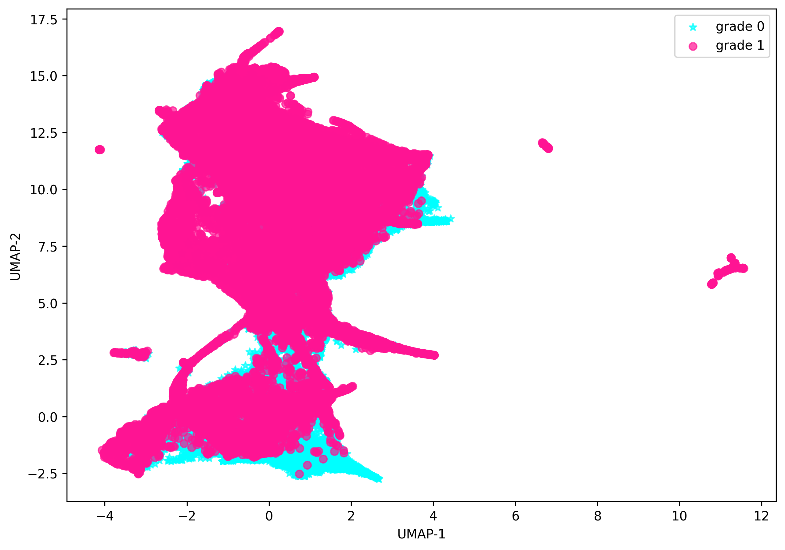
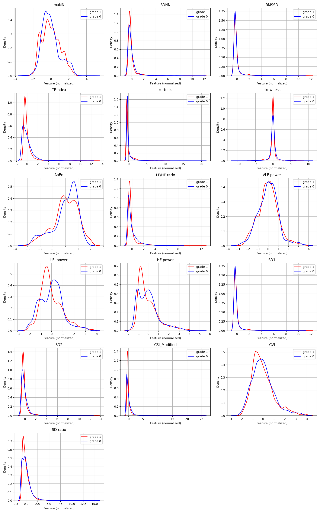

# UMAP & KDE Visualization

Visualize high-dimensional datasets in **2D and 3D** using **UMAP** and explore density patterns with **KDE**.  
The samples show visualizations of normal and abnormal heart rate variability features.
Outputs can also be saved as **GIFs** for dynamic 3D rotation and images from different angles of it.

---

## 🔹 Features
- 2D and 3D UMAP projections
- KDE density visualization
- Export visualizations as static images or GIFs
- Works with large datasets

---

## 🖼️ Examples

**3D UMAP (rotating GIF):**

**2D UMAP:**

**KDE:**

